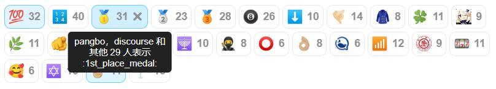

# Retort - 一个为 Discourse 设计的互动插件

[English](README.md) | [简体中文](README_zh.md)

Retort允许你和你的用户在 Discourse 帖子中添加类似Slack的互动表情。

## 安装

- 编辑你的Web镜像模板并添加项目的URL。（参考[如何安装插件](https://meta.discourse.org/t/install-plugins-on-a-self-hosted-site/19157)）
- 重新构建你的Web容器以安装插件。

## 特性

* 更友好的前端设计
* 更高效的数据库结构
* 更多自定义配置选项
* 支持管理人员移除特定表情
* 支持在网站统计信息显示使用情况

## 站点自定义配置

访问`/admin/site_settings/category/plugins?filter=plugin%3Aretort`以查看所有Retort插件的站点设置。

### 禁用特定表情

你可以通过`retort disabled emojis`站点设置来禁用特定的表情符号。

### 限制表情撤回时间

你可以通过`retort withdraw tolerance`站点设置来限制用户在多少秒内可以撤回他们的表情。

### 在特定类别禁用插件

你可以通过`retort disabled categories`站点设置在特定类别中禁用本插件。对于设定的类别，用户无法查看、添加或删除表情。

### 限制每个帖子的反应次数

站点设置项`retort allow multiple reactions`决定用户是否可以对同一个帖子多次反应。如果你只希望用户对每个帖子只能有一次反应（例如，如果你将Retort用作投票系统），将此选项设置为“false”。

## 用户个性化设置

用户可以通过偏好设置进行个性化设置。个性化设置包括隐藏被忽略用户的表情、隐藏所有表情。

## 问题报告和贡献

如果你在使用插件时遇到问题或有改进建议，欢迎通过 GitHub 提交问题或 Pull Request。

本插件目前支持英文和简体中文。如果你认为翻译需要改进或想为其他语言贡献翻译，欢迎提交 Pull Request。

### 许可协议

本仓库为[gdpelican/retort](https://github.com/gdpelican/retort)的分支，原插件基于 MIT 许可发布。

本插件在原插件基础上，由 @ShuiyuanSJTU 进行重构与维护，在 MIT 许可下发布。有关详细信息，请参阅 LICENSE 文件。